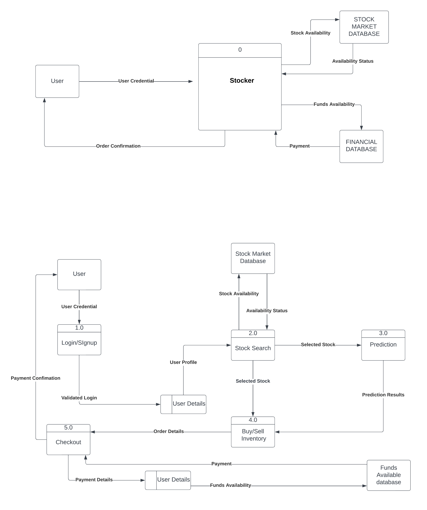

# Financial Trading Platform - Software Requirements Specification (SRS)

---

**Project Team:**

👨‍💻 Akshat Kabra (2101023)   
👨‍💻 Abhay Chaudhary (2101005)  
👨‍💻 Abhinav Mishra (2101009)   

---

1. [Introduction](#1-introduction)
   - 1.1 Purpose
   - 1.2 Scope

2. [System Overview](#2-system-overview)
   - 2.1 System Description
   - 2.2 Key Features
      - 2.2.1 Real-time Market Data Integration
      - 2.2.2 Advanced Algorithmic Trading
      - 2.2.3 Portfolio Management Tools
      - 2.2.4 Data Analysis and Predictive Analytics
      - 2.2.5 Third-party API Integration
      - 2.2.6 Modular Architecture for Scalability
      - 2.2.7 User-friendly Interface with Real-time Updates

3. [Functional Requirements](#3-functional-requirements)
   - 3.1 User Management
      - 3.1.1 User Registration and Authentication
      - 3.1.2 Profile Management
      - 3.1.3 Role-based Access Control
   - 3.2 Trading Features
      - 3.2.1 Real-time Market Data Display
      - 3.2.2 Buy and Sell Orders Execution
      - 3.2.3 Algorithmic Trading with Machine Learning Models
      - 3.2.4 Historical Trading Data Retrieval
   - 3.3 Portfolio Management
      - 3.3.1 Portfolio Overview
      - 3.3.2 Asset Allocation Tools
      - 3.3.3 Performance Analytics
   - 3.4 Data Analysis
      - 3.4.1 Market Trends Analysis
      - 3.4.2 Predictive Analytics Using Machine Learning
      - 3.4.3 Customizable Reports and Dashboards
   - 3.5 System Administration
      - 3.5.1 System Configuration and Settings
      - 3.5.2 Security Measures
      - 3.5.3 Log and Audit Trails

4. [Non-functional Requirements](#4-non-functional-requirements)
   - 4.1 Performance
      - 4.1.1 Real-time Data Updates
      - 4.1.2 Low Latency Execution of Trades
   - 4.2 Security
      - 4.2.1 Secure Authentication and Authorization
      - 4.2.2 Data Encryption for Financial Transactions
      - 4.2.3 Compliance with Regulatory Standards
   - 4.3 Scalability
      - 4.3.1 Modular Architecture for Easy Integration
      - 4.3.2 Scalable Database Architecture
   - 4.4 Usability
      - 4.4.1 Intuitive User Interface
      - 4.4.2 User Documentation and Support

5. [Technologies Used](#5-technologies-used)
   - 5.1 Frontend
   - 5.2 Backend
   - 5.3 Database
   - 5.4 Machine Learning
   - 5.5 System Requirements
      - 5.5.1 Hardware Requirements
      - 5.5.2 Software Requirements
      - 5.5.3 Network Requirements
   - 5.6 System Model and Life Cycle
      - 5.6.1 System Model
      - 5.6.2 Life Cycle

6. [Constraints](#6-constraints)
7. [Assumptions and Dependencies](#7-assumptions-and-dependencies)
8. [Decision Table and Decision Tree](#8-decision-table-and-decision-tree)
   - 8.1 Decision Table for User Interaction Flows
   - 8.2 Decision Tree for User Interaction Flows
9. [Data Flow Diagram (DFD)](#9-data-flow-diagram-dfd)
10. [Structure Chart](#10-structure-chart)
11. [Use Case UML](#11-use-case-uml)
12. [Sequence Diagram](#12-sequence-diagram)
13. [Collaboration Diagram](#13-collaboration-diagram)
14. [Updates](#14-updates)
---

## 1. Introduction

### 1.1 Purpose

The purpose of this Software Requirements Specification (SRS) is to provide detailed information on the requirements, features, and functionalities of the Financial Trading Platform. This document serves as a foundation for development, testing, and system evaluation.

### 1.2 Scope

The Financial Trading Platform is designed to be a comprehensive solution for investors, providing tools for trading, portfolio management, and data analysis. The platform will integrate real-time market data, advanced trading algorithms, and a user-friendly interface to cater to the diverse needs of users.

## 2. System Overview

### 2.1 System Description

The Financial Trading Platform is a web-based application developed to facilitate trading activities and portfolio management for investors. It encompasses both front-end and back-end components to deliver a seamless and secure user experience.

### 2.2 Key Features

#### 2.2.1 Real-time Market Data Integration

- **Objective:** Provide users with up-to-the-minute market information for informed decision-making.
- **Features:**
  - Integration with third-party APIs for real-time market data.
  - WebSocket implementation for instant updates.

#### 2.2.2 Advanced Algorithmic Trading

- **Objective:** Enable users to execute trades using sophisticated algorithms, including machine learning models for predictive analytics.
- **Features:**
  - Algorithmic trading engine with support for custom trading strategies.
  - Integration of machine learning libraries such as Scikit-Learn and TensorFlow.

#### 2.2.3 Portfolio Management Tools

- **Objective:** Empower users to efficiently manage their investment portfolios.
- **Features:**
  - Overview of current portfolio holdings and values.
  - Asset allocation tools for strategic investment planning.
  - Performance analytics and historical data retrieval.

#### 2.2.4 Data Analysis and Predictive Analytics

- **Objective:** Provide users with tools for in-depth data analysis and predictive modelling.
- **Features:**
  - Market trends analysis.
  - Predictive analytics using machine learning models.

#### 2.2.5 Third-party API Integration

- **Objective:** Expand the platform's capabilities by integrating with external financial services.
- **Features:**
  - Integration with third-party APIs for financial data and market analysis.

#### 2.2.6 Modular Architecture for Scalability

- **Objective:** Ensure the platform's flexibility and scalability for future enhancements.
- **Features:**
  - Modular architecture allowing for easy integration of new features and trading strategies.

#### 2.2.7 User-friendly Interface with Real-time Updates

- **Objective:** Provide an intuitive and responsive interface for seamless user interaction.
- **Features:**
  - Frontend developed using React.js and Redux.
  - Real-time updates through WebSocket for a dynamic user experience.

## 3. Functional Requirements

### 3.1 User Management

#### 3.1.1 User Registration and Authentication

- **Requirements:**
  - User registration with email verification.
  - Secure authentication using industry-standard protocols.

#### 3.1.2 Profile Management

- **Requirements:**
  - User profile creation and customization.
  - Profile information update and password reset functionality.

#### 3.1.3 Role-based Access Control

- **Requirements:**
  - Different user roles (e.g., admin, trader) with specific access privileges.
  - Role assignment and management by administrators.

### 3.2 Trading Features

#### 3.2.1 Real-time Market Data Display

- **Requirements:**
  - Real-time display of market data on the user interface.
  - Support for multiple asset classes (stocks, bonds, cryptocurrencies).

#### 3.2.2 Buy and Sell Orders Execution

- **Requirements:**
  - User-friendly interface for placing buy and sell orders.
  - Instant execution of market orders and support for various order types (limit, stop, etc.).

#### 3.2.3 Algorithmic Trading with Machine Learning Models

- **Requirements:**
  - Integration of machine learning models for predictive analytics.
  - Customizable algorithmic trading strategies.

#### 3.2.4 Historical Trading Data Retrieval

- **Requirements:**
  - Access to historical trading data for analysis and reporting.
  - User-friendly tools for retrieving specific historical data.

### 3.3 Portfolio Management

#### 3.3.1 Portfolio Overview

- **Requirements:**
  - Real-time display of the current portfolio overview.
  - Visualization of portfolio performance over time.

#### 3.3.2 Asset Allocation Tools

- **Requirements:**
  - Tools for strategic asset allocation based on user preferences and risk tolerance.
  - Recommendations for optimizing portfolio allocation.

#### 3.3.3 Performance Analytics

- **Requirements:**
  - Detailed performance analytics, including returns and risk metrics.
  - Comparative analysis against market benchmarks.

### 3.4 Data Analysis

#### 3.4.1 Market Trends Analysis

- **Requirements:**
  - Visualization tools for analyzing market trends.
  - Historical trend data for different asset classes.

#### 3.4.2 Predictive Analytics Using Machine Learning

- **Requirements:**
  - Integration of machine learning models for predictive analytics.
  - Predictions and recommendations based on historical and real-time data.

#### 3.4.3 Customizable Reports and Dashboards

- **Requirements:**
  - User-friendly tools for creating custom reports and dashboards.
  - Export functionality for sharing or further analysis.

### 3.5 System Administration

#### 3.5.1 System Configuration and Settings

- **Requirements:**
  - Administrative tools for configuring system parameters.
  - Customization settings based on user preferences.

#### 3.5.2 Security Measures

- **Requirements:**
  - Implementation of secure authentication and authorization mechanisms.
  - Data encryption for all financial transactions.

#### 3.5.3 Log and Audit Trails

- **Requirements:**
  - Comprehensive logging of system activities.
  - Audit trails for user actions and system events.

## 4. Non-functional Requirements

### 4.1 Performance

#### 4.1.1 Real-time Data Updates

- **Requirements:**
  - Data updates should occur in near real-time (within a few seconds).
  - Minimal latency in executing trades.

#### 4.1.2 Low Latency Execution of Trades

- **Requirements:**
  - The trading engine should execute orders with low latency.
  - Immediate response to user-initiated trades.

### 4.2 Security

#### 4.2.1 Secure Authentication and Authorization

- **Requirements:**
  - Use of secure authentication protocols (e.g., OAuth, JWT).
  - Role-based access control to ensure data integrity.

#### 4.2.2 Data Encryption for Financial Transactions

- **Requirements:**
  - All financial transactions should be encrypted using industry-standard encryption algorithms.
  - Secure communication channels for data transfer.

#### 4.2.3 Compliance with Regulatory Standards

- **Requirements:**
  - Adherence to financial regulations and standards.
  - Regular security audits to ensure compliance.

### 4.3 Scalability

#### 4.3.1 Modular Architecture for Easy Integration

- **Requirements:**
  - The platform should support the seamless integration of new features and trading strategies.
  - New modules can be added without affecting existing functionality.

#### 4.3.2 Scalable Database Architecture

- **Requirements:**
  - The database architecture should be scalable to accommodate a growing user base.
  - Support for horizontal scaling and partitioning of data.

### 4.4 Usability

#### 4.4.1 Intuitive User Interface

- **Requirements:**
  - The user interface should be intuitive and easy to navigate.
  - User-friendly design for both novice and experienced investors.

#### 4.4.2 User Documentation and Support

- **Requirements:**
  - Comprehensive user documentation for platform features and functionalities.
  - Customer support channels for addressing user queries and issues.

## 5. Technologies Used

### 5.1 Frontend

- **Frameworks:** React.js, Redux
- **Real-time Updates:** WebSocket

### 5.2 Backend

- **Frameworks:** Node.js, Express.js, Python (Algorithmic Trading), Django (Backend Services)

### 5.3 Database

- **Real-time Data:** MongoDB
- **Relational Data:** PostgreSQL

### 5.4 Machine Learning

- **Libraries:** Scikit-Learn, TensorFlow

## 5.5 System Requirements

### 5.5.1 Hardware Requirements

- **Server Hardware:**
  - Multi-core processors with sufficient processing power.
  - Adequate RAM for handling concurrent user requests.
  - Storage with redundancy for data reliability.

- **Client Hardware:**
  - Modern web browsers compatible with the platform.
  - Devices with internet connectivity.

### 5.5.2 Software Requirements

- **Server Software:**
  - Operating System: Linux-based distribution (e.g., Ubuntu Server).
  - Web Server: Nginx or Apache.
  - Database Management System: MongoDB for real-time data, PostgreSQL for relational data.
  - Backend Frameworks: Node.js, Express.js, Python, Django.

- **Client Software:**
  - Web Browser: Google Chrome, Mozilla Firefox, Safari.

### 5.5.3 Network Requirements

- **Network Infrastructure:**
  - High-speed internet connection for real-time data updates.
  - Secure communication protocols (HTTPS) for data transfer.

- **Data Backups:**
  - Regular backups of critical data to prevent data loss.

## 5.6 System Model and Life Cycle

### 5.6.1 System Model

The Financial Trading Platform adopts a client-server architecture with a three-tier structure. The client-side comprises a web-based interface developed using React.js and Redux, ensuring a dynamic and responsive user experience. The middle tier involves server-side processing, powered by Node.js and Express.js, managing core functionalities such as real-time data updates, algorithmic trading, and database interactions. The third tier involves Python and Django for additional backend services. The modular architecture allows for flexibility and easy integration of new features, ensuring scalability and maintainability.

### 5.6.2 Life Cycle

The development life cycle of the Financial Trading Platform aligns with an Agile methodology, incorporating key phases from concept to retirement. Specifically, the Agile approach, following Scrum principles, enables iterative development cycles, fostering continuous improvement and adaptation to evolving requirements. The project life cycle is divided into the following stages:

1. **Concept:**
   - The initial concept of the Financial Trading Platform is outlined, establishing the vision, goals, and objectives of the software product.

2. **Inception or Requirement Identification:**
   - Features and tasks are compiled into a prioritized backlog, providing a comprehensive list of requirements for the development team.
   - At this stage, the inception involves creating the software requirements, including key features, functional and non-functional requirements, and technological considerations.

3. **Sprint Planning:**
   - At the beginning of each sprint, the development team selects tasks from the backlog based on priority and complexity.
   - The selected tasks align with the requirements identified during the inception, guiding the development efforts.

4. **Development:**
   - The development team works on implementing selected features during the sprint, translating the identified requirements into working functionalities.
   - This phase involves the actual coding and programming of the Financial Trading Platform, adhering to the Agile principles of delivering incremental value.

5. **Testing:**
   - Quality assurance and testing are integral throughout the development phase, ensuring that each feature meets the specified requirements.
   - Rigorous testing is conducted to identify and rectify any issues or bugs in the system, ensuring the reliability and stability of the Financial Trading Platform.

6. **Review and Retrospective:**
   - At the end of each sprint, a review is conducted to showcase completed features, allowing stakeholders to provide feedback on the implemented functionalities.
   - A retrospective is held to discuss improvements and address challenges encountered during the development, fostering a culture of continuous improvement.

7. **Deployment:**
   - Completed features are deployed to a staging environment for testing, validating the functionalities in a controlled environment.
   - Subsequently, the features are deployed to the production environment for user access, allowing users to interact with and benefit from the latest additions to the Financial Trading Platform.

8. **Maintenance:**
   - Ongoing maintenance involves configuring system parameters, ensuring security measures, and maintaining log and audit trails.
   - The maintenance phase is an integral part of the Agile life cycle, addressing any issues that arise after the release and ensuring the continuous reliability of the Financial Trading Platform.

9. **Retirement:**
   - The retirement phase involves the conclusion of the project, marking the completion of the Software Requirements Specification and the development life cycle.

## 6. Constraints

- **Regulatory Compliance:** The system must adhere to financial regulations and security standards.
- **Compatibility:** The platform should be compatible with modern web browsers.
- **API Limitations:** Considerations for any limitations imposed by third-party APIs.

## 7. Assumptions and Dependencies

- **Data Availability:** Availability of real-time market data APIs for seamless integration.
- **Internet Connectivity:** Users are assumed to have adequate internet connectivity for accessing the platform.

## 8. Decision Table and Decision Tree

### 8.1 Decision Table for User Interaction Flows

#### User Interaction Decision Table

The following decision table outlines various user interaction flows based on specific conditions and actions within the Financial Trading Platform:

### Decision Table for User Interaction Flows

| User Registered? | Pre-existing ID? | Signup Complete? | Login Successful? | Account Accessed? | Portfolio Viewed? | Stock Searched? | Payment Successful? | Buy/Sell? | Logout? | Outcome                                    |
| ----------------- | ----------------- | ----------------- | ------------------ | ------------------ | ------------------- | ---------------- | --------------------- | --------- | ------- | ------------------------------------------- |
| No                | Not Applicable    | No                | Not Applicable     | Not Applicable     | Not Applicable      | Not Applicable   | Not Applicable        | Not Applicable | Not Applicable | User needs to register                     |
| No                | Not Applicable    | Yes               | Yes                | Yes                | No                  | No               | Not Applicable        | Not Applicable | Yes     | User logs out without viewing portfolio or searching stocks |
| No                | Not Applicable    | Yes               | Yes                | Yes                | Yes                 | No               | Not Applicable        | Not Applicable | Yes     | User logs out after viewing portfolio      |
| No                | Not Applicable    | Yes               | Yes                | Yes                | Yes                 | Yes              | Yes                   | Yes         | No      | User buys/sells stocks                     |
| No                | Not Applicable    | Yes               | Yes                | Yes                | Yes                 | Yes              | Yes                   | No          | Yes     | User logs out after viewing stocks but without buying/selling |
| Yes               | Yes               | Not Applicable    | Yes                | Yes                | No                  | No               | Not Applicable        | Not Applicable | Yes     | User logs out without viewing portfolio or searching stocks |
| Yes               | Yes               | Not Applicable    | Yes                | Yes                | Yes                 | No               | Not Applicable        | Not Applicable | Yes     | User logs out after viewing portfolio      |
| Yes               | Yes               | Not Applicable    | Yes                | Yes                | Yes                 | Yes              | Yes                   | Yes         | No      | User buys/sells stocks                     |
| Yes               | Yes               | Not Applicable    | Yes                | Yes                | Yes                 | Yes              | Yes                   | No          | Yes     | User logs out after viewing stocks but without buying/selling |
| Yes               | No                | Not Applicable    | No                 | Not Applicable     | Not Applicable      | Not Applicable   | Not Applicable        | Not Applicable | Not Applicable | Invalid Username/Password                  |

#### Decision Table Logic:

1. **User needs to register:**
   - If the user is not registered, has no pre-existing ID, signup is not complete, and login is not successful, the outcome is that the user needs to register.

2. **User logs out without viewing portfolio or searching stocks:**
   - If the user is not registered, login is successful, and the user logs out without viewing the portfolio or searching stocks, the outcome is that the user logs out without engaging in portfolio or stock activities.

3. **User logs out after viewing portfolio:**
   - If the user is not registered, login is successful, the user views the portfolio, and then logs out, the outcome is that the user logs out after viewing the portfolio.

4. **User buys/sells stocks:**
   - If the user is not registered, login is successful, the user views the portfolio, searches stocks, payment is successful, and either buys or sells stocks, the outcome is that the user engages in buying/selling stocks.

5. **User logs out after viewing stocks but without buying/selling:**
   - If the user is not registered, login is successful, the user views the portfolio, searches stocks, payment is successful, and then logs out without buying/selling, the outcome is that the user logs out after viewing stocks but without engaging in buying/selling.

6. **User logs out without viewing portfolio or searching stocks (Registered):**
   - If the user is registered, has a pre-existing ID, signup is not applicable, login is successful, but the user logs out without viewing the portfolio or searching stocks, the outcome is that the user logs out without engaging in portfolio or stock activities.

7. **User logs out after viewing portfolio (Registered):**
   - If the user is registered, has a pre-existing ID, signup is not applicable, login is successful, the user views the portfolio, and then logs out, the outcome is that the user logs out after viewing the portfolio.

8. **User buys/sells stocks (Registered):**
   - If the user is registered, has a pre-existing ID, signup is not applicable, login is successful, the user views the portfolio, searches stocks, payment is successful, and either buys or sells stocks, the outcome is that the user engages in buying/selling stocks.

9. **User logs out after viewing stocks but without buying/selling (Registered):**
   - If the user is registered, has a pre-existing ID, signup is not applicable, login is successful, the user views the portfolio, searches stocks, payment is successful, and then logs out without buying/selling, the outcome is that the user logs out after viewing stocks but without engaging in buying/selling.

10. **Invalid Username/Password:**
    - If the user is registered, has no pre-existing ID, signup is not applicable, login is not successful, and the outcome is an invalid username/password.

### 8.2 Decision Tree for User Interaction Flows

#### User Interaction Decision Tree

The decision tree visually represents the logic and outcomes of various user interactions within the Financial Trading Platform. The nodes and branches illustrate the conditions and actions leading to specific outcomes.

## 9. Data Flow Diagram (DFD)

### 9.1 Level 1 Data Flow Diagram

The Level 1 Data Flow Diagram (DFD) provides an overview of the main processes and data flows within the Financial Trading Platform. It illustrates the interactions between external entities, processes, and data stores at a high level of abstraction.

#### Overview:
The Level 1 DFD depicts the flow of data and activities within the Financial Trading Platform at a macro level, focusing on key processes and their interactions. It provides a structured representation of the system's functionality, serving as a foundation for understanding the system's behaviour and identifying potential areas for optimization and improvement.

#### Explanation:
- **User Interaction (Process 1):** This main process encapsulates the overall interaction between users and the Financial Trading Platform. It encompasses activities such as user registration, login, trading, portfolio management, and system administration.
- **External Entities (Entities 1-5):** External entities represent the sources or destinations of data within the system. They include users, the trading platform, market data providers, and external services.
- **Processes (Processes 1.1-5.2):** These processes represent the various actions and tasks performed within the system. They include user authentication, trading execution, portfolio management, data analysis, and order processing.
- **Data Stores (Data Stores 1-2):** Data stores represent repositories of information within the system. They include databases, caches, and storage systems used for storing user data, market data, and system configurations.

### 9.2 Level 2 DFD Diagram
The Level 2 Data Flow Diagram (DFD) delves deeper into the processes identified in the Level 1 DFD, providing a more detailed view of the system's functionality and interactions.

#### Overview:
The Level 2 DFD expands upon the processes identified in the Level 1 DFD, breaking them down into finer-grained sub-processes and data flows. It offers a more detailed understanding of how data moves within the system and how individual processes contribute to the overall functionality of the Financial Trading Platform.

#### Explanation:
- **User Details/Login Choice/Login/Signup (Process 1):** This process manages the user's decision to either login or sign up, including the validation of login credentials and the entry of signup details.
- **Stock Details (Process 2):** Handles the selection and analysis of stocks, predicting future trends and analyzing indicators.
- **Analysis (Process 3):** Analyzes the selected stock using models and indicators, predicts its movement, and presents the results within a specified time frame.
- **Options (Process 4):** Provides options for managing stocks, including adding them to inventory, buying/selling, and confirming orders.
- **Order Details (Process 5):** Manages the details of orders placed, including proceeding to checkout, selecting payment methods, and confirming orders.

### Explanation of Level-2 DFD:
The Level 2 DFD provides a more detailed view of the processes identified in the Level 1 DFD, breaking them down into smaller, more manageable sub-processes. Each component is assigned a unique identifier and described in detail, enhancing clarity and understanding of the system's functionality.

## 10. Structure Chart

The Structure Chart provides a hierarchical visualization of the modules and their interrelationships within the Financial Trading Platform. It illustrates the organization of the software components and their interactions, offering a systematic representation of the system's architecture.

## 11. Use Case UML

The Use Case Unified Modeling Language (UML) diagrams provide a visual representation of the interactions between actors (users or external systems) and the Financial Trading Platform. These diagrams illustrate various scenarios of how users interact with the system to achieve specific goals or tasks.

## 12. Sequence Diagram

The Sequence Diagram depicts the interactions between different components and actors within the Financial Trading Platform. It illustrates the sequence of messages and actions that occur during specific user interactions, providing a detailed view of the system's behaviour.

## 13. Collaboration Diagram

The Collaboration Diagram illustrates the interactions between objects within the Financial Trading Platform. It shows how objects collaborate to achieve specific tasks or functionalities, providing a detailed view of the relationships and interactions between different components.

## 14. Updates

| Version | Date       | Updates |
| ------- | ---------- | ------- |
| 1.0     | 16-01-2024 | - Initial creation of the Software Requirements Specification (SRS) for the Financial Trading Platform. |
| 1.1     | 24-01-2024 | - Added index.   - Modified and streamlined the life cycle description in Section 5.6.2 of the SRS.   - Removed the Conclusion section for a more concise document structure.   - Updates are made to enhance clarity and align with the iterative nature of Agile development. |

   
---
